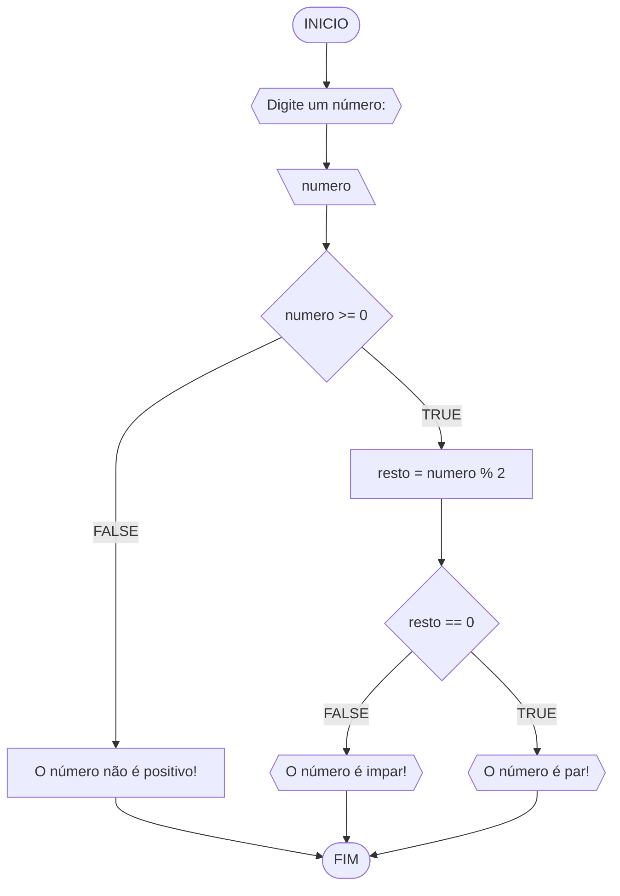
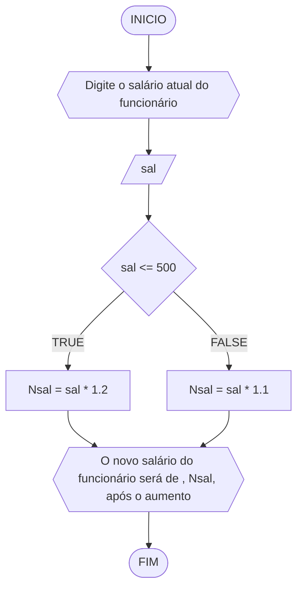
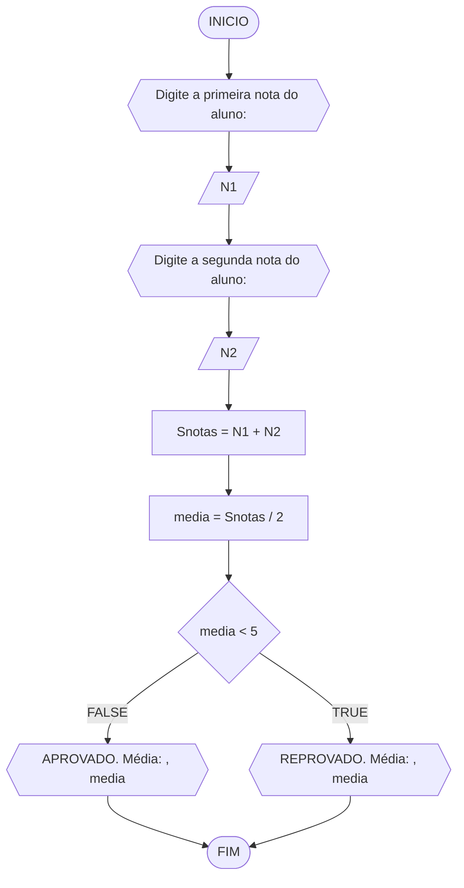
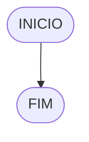

# UNIFOR
**Nome**: Nome do estudante <br>
**Disciplina**: Raciocínio lógico algorítmico

## Lista de exercícios 01

### Exercício 01 (1 ponto)
Represente, em fluxograma e pseudocódigo, um algoritmo para determinar se um número inteiro e positivo é par ou impar.

#### Fluxograma (0,25 ponto)



#### Pseudocódigo (0,5 ponto)
```
1  ALGORTIMO verifica_par_impar
2  DECLARE numero, resto: INTEIRO
3  INICIO
4  ESCREVA "Digite um número: "
5  LEIA numero
6  SE numero >= 0 ENTAO                  // verifica se o inteiro é positivo
7    resto = numero % 2                 // calcula o resto da divisão por 2
8    SE resto == 0 ENTAO                // verifica se o resto é igual a zero
9      ESCREVA "O número é par!"
10   SENAO
11     ESCREVA "O número é impar!"
12   FIM_SE
13  SENAO                                // caso inteiro for negativo (condição linha 5)
14    ESCREVA "O número deve ser postivo!"
15  FIM_SE
16 FIM
```

#### Teste de mesa (0,25 ponto)
| numero | numero >= 0 | resto | resto == 0 | Saída |
| -- | -- | -- | -- | -- | 
| -1 | F |   |   | "O número deve ser postivo!" |
| 0  | V | 0 | V | "O número é par!" |
| 13 | V | 1 | F | "O número é impar!" |
| 30 | V | 0 | V | "O número é par!" |

## Exercício 02 (3 pontos)
Represente, em fluxograma e pseudocódigo, um algoritmo para calcular o novo salário de um funcionário. 
Sabe-se que os funcionários que recebem atualmente salário de até R$ 500 terão aumento de 20%; os demais terão aumento de 10%.

#### Fluxograma (1.0 ponto)



#### Pseudocódigo (1.0 ponto)

```
Algoritmo Salario
DECLARE sal, Nsal: REAL
INICIO
   ESCREVA "Digite o salário atual do funcionário: "
   LEIA sal
   SE sal <= 500 ENTAO
      Nsal <- sal * 1.2
   SENAO
      Nsal <- sal * 1.1
   FIM_SE
   ESCREVA "O salário do funcionário será de R$ ", Nsal, " após o aumento"
FIM_ALGORITMO
```

#### Teste de mesa (1.0 ponto)

| sal | sal <= 500 | Nsal | Saída |
| -- | -- | -- | -- | -- | 
| 430 | V | 430 * 1.2 = 516  | "O salário do funcionário será de R$ 516 após o aumento" |
| 870 | F | 870 * 1.1 = 957  | "O salário do funcionário será de R$ 957 após o aumento" |
| 374 | V | 374 * 1.2 = 488.80 | "O salário do funcionário será de R$ 488.80 após o aumento" |
| 537 | F | 537 * 1.1 = 590.70 | "O salário do funcionário será de R$ 590.70 após o aumento" |

## Exercício 03 (3 pontos)
Represente, em fluxograma e pseudocódigo, um algoritmo para calcular a média aritmética entre duas notas de um aluno e mostrar sua situação, que pode ser aprovado ou reprovado.

#### Fluxograma (1 ponto)



#### Pseudocódigo (1 ponto)

```
Algoritmo media
DECLARE N1, N2, Snotas, media: REAL
INICIO
   ESCREVA "Digita a primeira nota do aluno: "
   LEIA N1
   ESCREVA "Digite a segunda nota do aluno: "
   LEIA N2
   Snotas <- N1 + N2
   media <- Snotas / 2
   SE media < 5.00 ENTAO
      ESCREVA "REPROVADO. Média: ", media:3:2
   SENAO
      ESCREVA "APROVADO. Média: ", media:3:2
FIM_ALGORITMO
```

#### Teste de mesa (1 ponto)

| N1  | N2  | Snotas | media |       Saída          | 
| --  | --  |   --   |   --  |         --           | 
| 9.2 | 7.8 |   17   | 8.50  | APROVADO. Média: 8.50|
| 5.1 | 4.5 |   9.6  | 4.80  |REPROVADO. Média: 4.80|

## Exercício 04 (3 pontos)
Represente, em fluxograma e pseudocódigo, um algoritmo que, a partir da idade do candidato(a), determinar se pode ou não tirar a CNH. 
Caso não atender a restrição de idade, calcular quantos anos faltam para o candidato estar apto.

#### Fluxograma (1.0 ponto)



#### Pseudocódigo (1.0 ponto)

```
Algoritmo ContaAprovacoes
FIM_ALGORITMO
```

#### Teste de mesa (1.0 ponto)

| nome_coluna1 | nome_coluna2 | nome_coluna3 | nome_coluna4 | nome_coluna5 | 
|      --      |      --      |      --      |      --      |      --      | 
| Adicione     | espaço       | se quiser    |  alinhar     | as barras    |
| verticais,   | mas          | não é        | obrigatório. | Entendido ?  |
