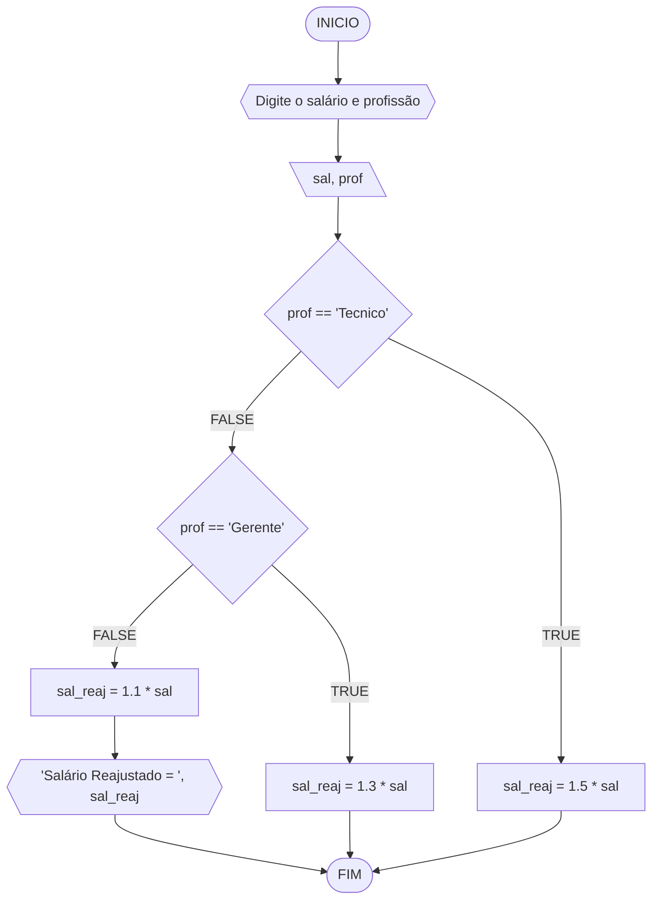
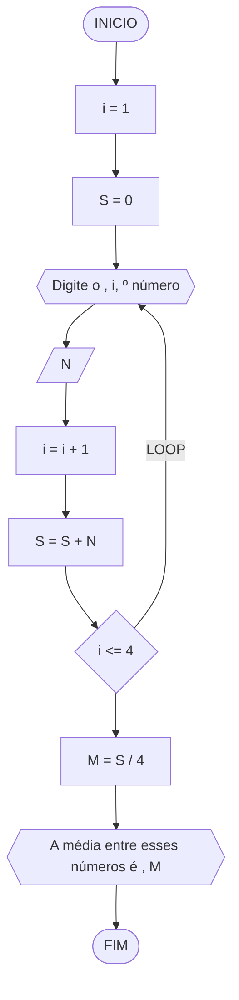
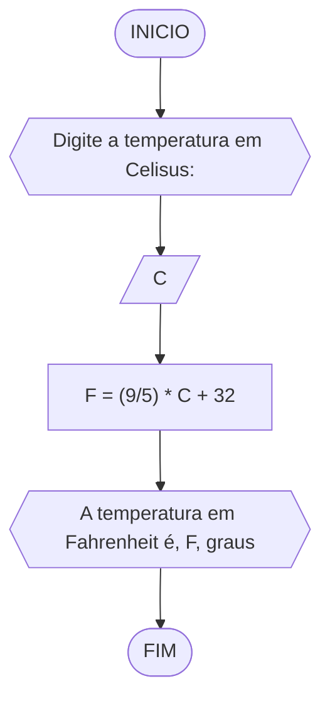
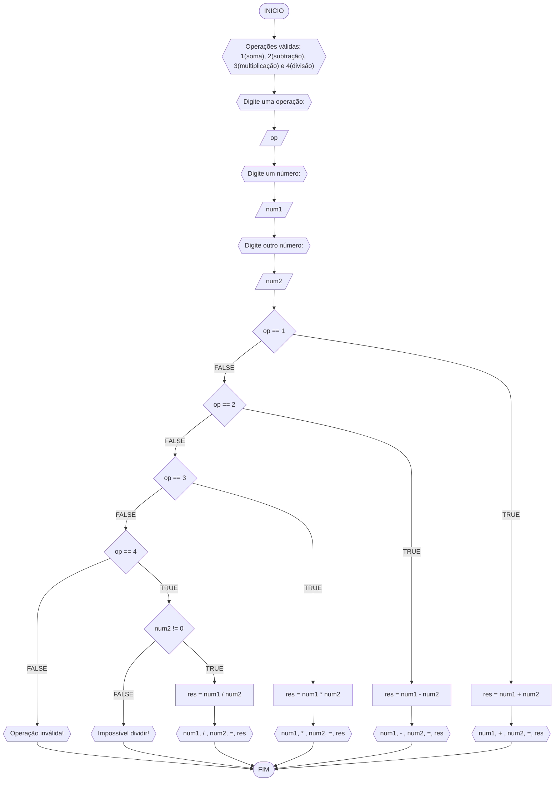
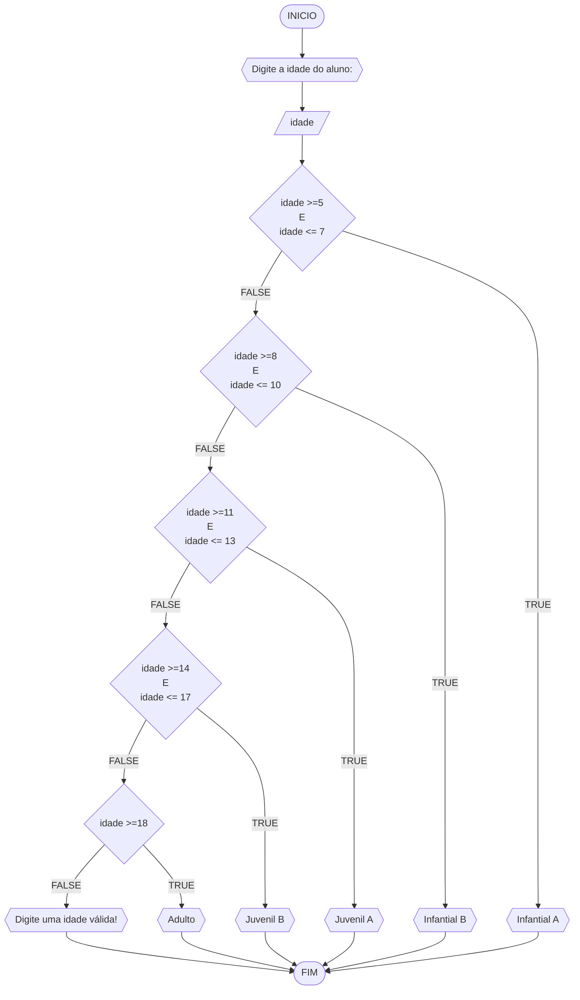

# UNIFOR
**Nome**: Nome do estudante <br>
**Disciplina**: Raciocínio lógico algorítm

## Exercício exemplo
Represente, em fluxograma e pseudocódigo, um algoritmo para calcular o adicional de salário de funcionário por cargo de uma empresa fictícia. Sabe-se que os funcionários de cargo técnico receberão reajuste de 50%, cargo de gerência, um reajuste de 30% e demais, um reajuste de 10%. 

#### Fluxograma


#### Pseudocódigo
```
1  ALGORITMO calReajuste
2  DECLARE  sal, sal_reaj: real, prof: caractere
3  INICIO
4  LEIA sal, prof
5  ESCOLHA
6   CASO prof == “Técnico”		// caso 1
7     sal_reaj ← 1.5 * sal
8   CASO prof = “Gerente”		// caso 2
9     sal_reaj ← 1.3 * sal
10  SENÃO
11    sal_reaj ← 1.1 * sal
12 FIM_ESCOLHA
13 ESCREVA “Salário Reajustado = “, sal_reaj
14 FIM
```

#### Teste
| sal | prof | prof == “Técnico” | prof = “Gerente” | sal_reaj | Saída |
| -- | -- | -- | -- | -- | -- |
| 1000 | Técnico | V | F | 1500 | “Salário Reajustado = 1500“ |
| 2000 | Gerente | F | V | 2600 | “Salário Reajustado = 2600“ |
| 9000 | Diretor | F | F | 9900 | “Salário Reajustado = 9900“ |

## Lista de exercícios 02

### Exercício 01 (2.5 pontos)
Calcule a média de quatro números inteiros dados.

#### Fluxograma (1.0 ponto)



#### Pseudocódigo (1.0 ponto)

```
Algoritmo Media
DECLARE i, S, N: INTEIRO    M: REAL        
INICIO
    i <- 1
    S <- 0
    REPITA
        ESCREVA "Digite o ", i, "º número: "
        LEIA N
        i <- i + 1
        S <- S + N
    ATE_QUE i <= 4
    M <- S / 4
    ESCREVA "A média entre esses números é ", M
FIM_ALGORITMO
```

#### Teste de mesa (0.5 ponto)

| i | S    | N    | i <= 4 | M  |
| - |  --  |  --  |   --   | -- | 
| 1 | 0.0  | 4.5  |   V    | -- |
| 2 | 4.5  | 7.3  |   V    | -- |
| 3 | 11.8 | 5.0  |   V    | -- |
| 4 | 16.8 | 7.0  |   V    | 23.8 / 4 = 5.95 |

### Exercício 02 (2.5 pontos)
Leia uma temperatura dada em Celsius (C) e imprima o equivalente em Fahrenheit (F). (Fórmula de conversão: F = (9/5) * C + 32)

#### Fluxograma (1.0 ponto)



#### Pseudocódigo (1.0 ponto)

```
```java
ALGORTIMO ConverteCelsiusFarenheit
DECLARE C, F: REAL

INICIO

    // Entrada do usuário com a temperatura em Celsius
    ESCREVA "Digite a temperatura em Celisus:"

    // Armazena o valor da temperatura em Celsius
    LEIA C

    // Fórmula que converte a temperatura de Celsius para Fahrenheit
    F <- (9/5) * C + 32

    // Exibe o valor da temperatura em Fahrenheit
    ESCREVA "A temperatura em Fahrenheit é", F, "graus"

FIM
```

#### Teste de mesa (0.5 ponto)

| C  | F  | saída                                  | 
| -- | -- | --                                     |
| 0  | 32 | A temperatura em Fahrenheit é 32 graus |

### Exercício 03 (2.5 pontos)
Receba dois números reais e um operador e efetue a operação correspondente com os valores recebidos (operandos). 
O algoritmo deve retornar o resultado da operação selecionada simulando todas as operações de uma calculadora simples.

#### Fluxograma (1.0 ponto)



#### Pseudocódigo (1.0 ponto)

```java
ALGORITMO CalculadoraSimples
DECLARE op: INTEIRO; num1,num2,res: REAL
INICIO

    // Descreve as operações válidas com seus respectivos números equivalentes
    ESCREVA "Operações válidas: 1(soma), 2(subtração), 3(multiplicação) e 4(divisão)"

    // Entrada do usuário com a operação
    ESCREVA "Digite uma operação:"

    // Armazena o número equivalente à operação a ser realizada
    LEIA op

    // Entrada do usuário com o 1º número solicitado
    ESCREVA "Digite um número:"
    LEIA num1

    // Entrada do usuário com o 2º número solicitado
    ESCREVA "Digite outro número:"
    LEIA num2

    // Indica que o que vai ser feito depende de alguma variável
    ESCOLHA

        // Executa as instruções que devem ser feitas caso o usuário tenha atribuído 1 à variável op
        CASO op == 1

            // Calcula o valor de res (caso o usuário tenha admitido op como sendo 1)
            res = num1 + num2

            // Exibe a operação e o resultado
            ESCREVA num1, "+", num2, "=", res

        // Executa as instruções que devem ser feitas caso o usuário tenha atribuído 2 à variável op
        CASO op == 2

            // Calcula o valor de res (caso o usuário tenha admitido op como sendo 2)
            res = num1 - num2

            // Insira seu comentário
            ESCREVA num1, "-", num2, "=", res

        // Executa as instruções que devem ser feitas caso o usuário tenha atribuído 3 à variável op
        CASO op == 3

            // Calcula o valor de res (caso o usuário tenha admitido op como sendo 3)
            res = num1 * num2

            // Exibe a operação e o resultado
            ESCREVA num1, "*", num2, "=", res

        // Executa as instruções que devem ser feitas caso o usuário tenha atribuído 4 à variável op
        CASO op == 4

            // Executa as ordens seguintes caso a variável num2 seja diferente de zero
            SE num2 != 0 ENTAO

                // Calcula o valor de res (caso o usuário tenha admitido op como sendo 4)
                res = num1 / num2

                // Exibe a operação e o resultado
                ESCREVA num1, "/", num2, "=", res

            // Executa as ordens seguintes caso a variável num2 seja igual a zero
            SENAO
                ESCREVA "Impossível dividir!"

            FIM_SE

    // Indica o que deve acontecer caso o usuário atribua um valor diferente dos dados anteriormente à variável op
    SENAO
        ESCREVA "Operação inválida!"

    FIM_ESCOLHA

FIM
```

#### Teste de mesa (0.5 ponto)

| num1 | num2 | op | num2 != 0 | res | saída               | 
| --   | --   | -- | --        | --  | --                  |
| 1    | 0    | 1  |           | 1   | 1 + 0 = 1           |
| 1    | 0    | 2  |           | 1   | 1 - 0 = 1           |
| 1    | 0    | 3  |           | 0   | 1 * 0 = 0           |
| 1    | 0    | 4  | False     |     | Impossível dividir! |
| 1    | 2    | 4  | True      | 0.5 | 1 / 2 = 0,5         |
| 1    | 2    | 5  |           |     | Operação inválida!  |

### Exercício 04 (2.5 pontos)
Elaborar um algoritmo que, dada a idade, classifique nas categorias: infantil A (5 - 7 anos), infantil B (8 -10 anos), juvenil A (11 - 13 anos), juvenil B (14 -17 anos) e adulto (maiores que 18 anos).

#### Fluxograma (1.0 ponto)



#### Pseudocódigo (1.0 ponto)

```
ALGORTIMO ClassificaCategoria
DECLARE idade: INTEIRO

INICIO

    // Entrada do usuário com a idade do aluno
    ESCREVA "Digite a idade do aluno:"

    // Armazena o valor da idade do aluno
    LEIA idade

    // Indica que as instruções seguintes dependem de uma variável
    ESCOLHA

        // Executa as instruções a serem feitas caso a variável idade esteja entre 5 e 7
        CASO idade >=5 E idade <= 7

            // Exibe a categoria do aluno
            ESCREVA "Infantil A"

        // Executa as instruções a serem feitas caso a variável idade esteja entre 8 e 10
        CASO idade >=8 E idade <= 10

            // Exibe a categoria do aluno
            ESCREVA "Infantil B"

        // Executa as instruções a serem feitas caso a variável idade esteja entre 11 e 13
        CASO idade >=11 E idade <= 13

            // Exibe a categoria do aluno
            ESCREVA "Juvenil A"

        // Executa as instruções a serem feitas caso a variável idade esteja entre 14 e 17
        CASO idade >=14 E idade <= 17

            // Exibe a categoria do aluno
            ESCREVA "Juvenil B"

        // Executa as instruções a serem feitas caso a variável idade seja maior ou igual a 18
        CASO idade >=18

            // Exibe a categoria do aluno
            ESCREVA "Adulto"

    // Executa as funções que devem ser feitas caso o valor da variável idade não esteja entre os valores dados anteriormente
    SENAO

        // Indica que a idade que o usuário colocou não está nas categorias dadas
        ESCREVA "Digite uma idade válida!"

    FIM_ESCOLHA

FIM
```

#### Teste de mesa (0.5 ponto)

| idade | idade >=8 E idade <= 10 | idade >=11 E idade <= 13 | idade >=14 E idade <= 17 | idade >=18 | saída                       | 
| --    | --                      | --                       | --                       | --         | --                          |
| 4     | False                   | False                    | False                    | False      | Digite uma idade válida!    |
| -4    | False                   | False                    | False                    | False      | Digite uma idade válida!    |
| 8     | True                    | False                    | False                    | False      | Infantial A                 |
| 11    | False                   | True                     | False                    | False      | Infantial B                 |
| 17    | False                   | False                    | True                     | False      | Infantial C                 |
| 21    | False                   | False                    | False                    | True       | Adulto                      |
